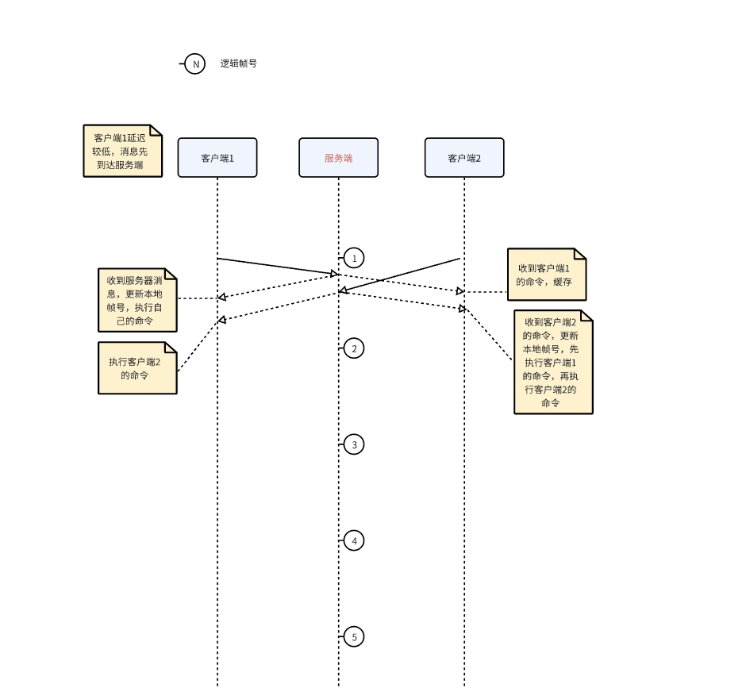

# 乐观帧同步

### 游戏背景

1. 格子地图，玩家是一个个棋子，每2秒将这2秒内最后一个指令发送到服务端。
2. 网络协议KCP， 保证消息顺序
3. 数据序列化 flatbuffers
4. 客户端UE， 服务端GO

### 开始游戏流程

1. 服务端创建房间，等待N名玩家进入房间
2. 服务端与客户端校时，客户端记录系统时间误差, 会因为RTT存在一定的误差， 多轮对时，尽量减小误差
3. 服务端向各个客户端发送【进入游戏】消息， 所有客户端进入加载阶段， 加载完毕后，客户端向服务端发送【加载完毕】消息
4. 所有客户端加载完毕后， 服务端向客户端发送【游戏开始】消息， 约定好在指定unixtime一起开始游戏，各个客户端根据之前记录的时间戳误差，自行计算应该在何时启动。（最大程度消除RTT带来的各个客户端的时间误差）

### 游戏主流程

#### 指令数据

```cpp
struct PlayerInput 
{
    int LogicFrame;
    string Command;
}
```

#### 服务端

1. 按照30帧帧率Tick
2. 逻辑帧号每60帧步进1
3. 收到的玩家数据存入该玩家的输入队列
4. Tick逻辑

```cpp
void Tick()
{
    WorldSyncMessage Message;
    for(auto& Tuple:InptMap)
    {
        const auto PlayerID = Tuple.Key;
        auto& InputArray = Tuple.Value;

        将小于等于当前逻辑帧号的输入放入消息（PlayerID, InputArray, Message）;
        移除小于当前在逻辑帧号的消息（InputArray）;
    }

    FrameAccumulate++;
    if (FrameAccumulate == 60)
    {
        FrameAccumulate = 0；
        LogicFrame++;
    }
  
    Message.LogicFrame = LogicFrame;
     // 如果Messgage不为空，向各个客户端转发输入
    if (!Message.IsEmpty())
    {
        Send(Message);
    }
}
```

> 修改： 实现时消息为立刻转发， worldSync只用来逻辑帧数， 因为如果不立刻转发消息，那么最多会存在服务端tick间隔的延迟

#### 客户端

1. 客户端不考虑帧率， 累计运行时间来发送指令
2. 每2秒，向服务端发送这2秒内的最后一次Input，无指令也会发送空Input，帧号为逻辑帧号
3. 客户端不进行预测，Input输入后客户端不会立刻执行(Todo：以后可以考虑修改为预测，增加流畅度？)
4. 客户端逻辑号更新逻辑（因为无输入也会发送指令，因此理想情况下，客户端总会收到包含自己指令的消息）

```cpp
void OnMessageReceived(WorldSyncMessage Message)
{
    // LocalLogicFrame 客户端当前逻辑帧号
    if (服务端Message包含本地客户端指令 && Message.LogicFrame > LocalLogicFrame) 
    {
        LocalLogicFrame = Message.LogicFrame;
    }
}
```

5. Tick逻辑

```cpp
void Tick(float DeltaTime)
{
    Timer+=DeltaTime;
    if (Timer >= 2.f)
    {
        // Todo: 理想状态下，不发生卡顿， 不会出现Timer >= 4.f的情况
        Timer -= 2.f;
        发送玩家输入();
    }

    // LocalLogicFrame 客户端当前逻辑帧号
    // MessageMap <逻辑帧号, TArray<PlayerInput>>
    执行帧号小于等于LocalLogicFrame的指令（）；
}
```

### 理想状态

> 各个客户端未发生卡顿和过大延迟时

1. 客户端A， 2秒时，向服务器发送在0号逻辑帧的指令，当消息到达服务端时，由于RTT， 服务端此时的帧号理想状态为1，构造了一个带有客户端A的输入并下发到了各个客户端。
2. 客户端A收到服务端的返回， 是自己在输入， 于是客户端A更新本地逻辑帧号，并执行指令
3. 各个客户端应该在2秒后，陆续收到各个客户端的操作指令
4. 一图流



5. 表演上，每隔2秒，玩家就会【陆续】看到各个棋子执行一次指令， 理想情况下， 2秒内，这一轮每个玩家都会执行一次指令，并且有序

</br>
</br>
</br>

# 疑问

+ 未发生异常情况时，同步逻辑是否有问题？

</br>

+ 客户端出现卡顿、延迟等情况时， 假如发生了以下场景：
> 1.  尽管在游戏开始时尽量保证了各端同时开始，但应该仍会出现有的客户端慢一点、有的快一点的情况，客户端与服务端之间并未持续进行时间校准，仅通过游戏开始后“已经度过的时间“or”系统时间“是否能保证各端的时间不会差距过大？（我自己感觉应该没问题）
> 
> 2. 假设某个客户端因为卡顿，某一帧时长特别长，累计时长已达到4秒或者更久，那么它应该会陆续收到很多消息。计划上， 处理这个情况，我打算服务端做处理，如果在第N个逻辑帧经过30个Tick后， 仍未收到某端的指令，则认为它此次逻辑帧无输入；卡顿客户端会加速播放动画，追上逻辑帧，输入会在下次轮到发送消息时发送。这样处理是否可行？

 